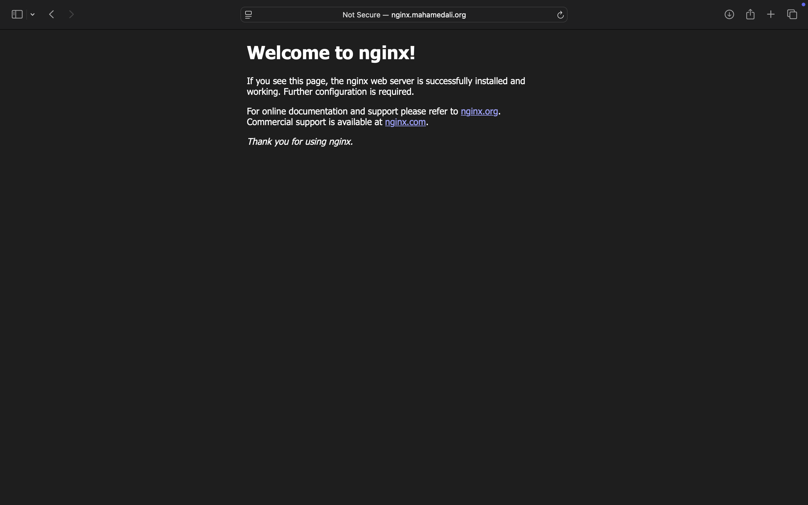

# Networking

This repository documents my journey learning networking fundamentals essential to DevOps. The focus was on practical cloud networking using AWS, including routing, DNS and secure web server deployment.

## What I Learnt

### 🔹 Public vs Private IPs
- Learned the distinction between **public** and **private IPs** in cloud environments.
- Understood how **Elastic IPs** can be attached to EC2 instances to ensure persistent public access.

### 🔹 VPC & Subnetting
- Created a **Virtual Private Cloud (VPC)** and divided it into public and private **subnets**.
- Learned how to isolate services and control traffic between different parts of a network.

### 🔹 Routing
- Set up **routing tables** to manage network traffic.
- Understood the difference between **static routing** (manual) and **dynamic routing** (via protocols like RIP/OSPF).

### 🔹 Security Groups & PSI
- Configured **security groups** and **PSI (Public Security Interface)** to restrict traffic to and from EC2 instances.
- Applied least-privilege principles to reduce attack surface.

### 🔹 DNS & Domain Linking
- Purchased and configured a custom domain (`mahamedali.org`) using **Cloudflare**.
- Created and modified **DNS records** (A, CNAME) to link the domain to a running EC2 instance.

### 🔹 NGINX Web Server
- Deployed **NGINX** on an EC2 instance to serve content over HTTP.
- Verified server setup via browser and domain resolution.

## Assignment Screenshot

## Summary

This module helped bridge the gap between theoretical networking and practical infrastructure setup. I now feel more confident with:
- Cloud networking and security best practices
- DNS management and domain linking
- Version control using Git and GitHub for DevOps documentation
